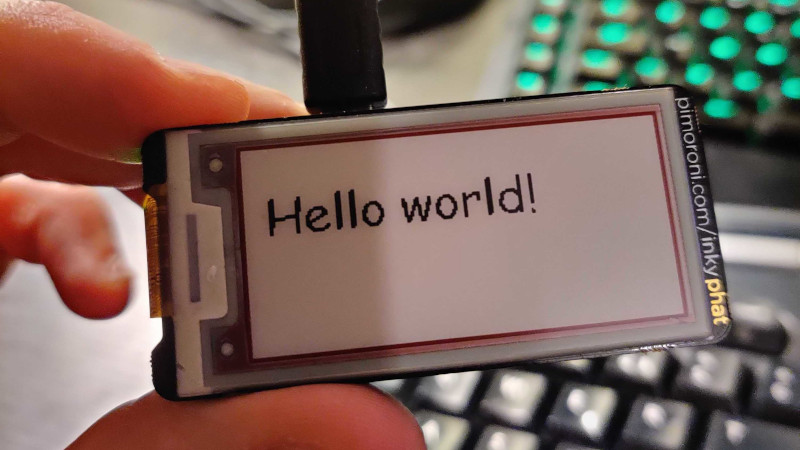
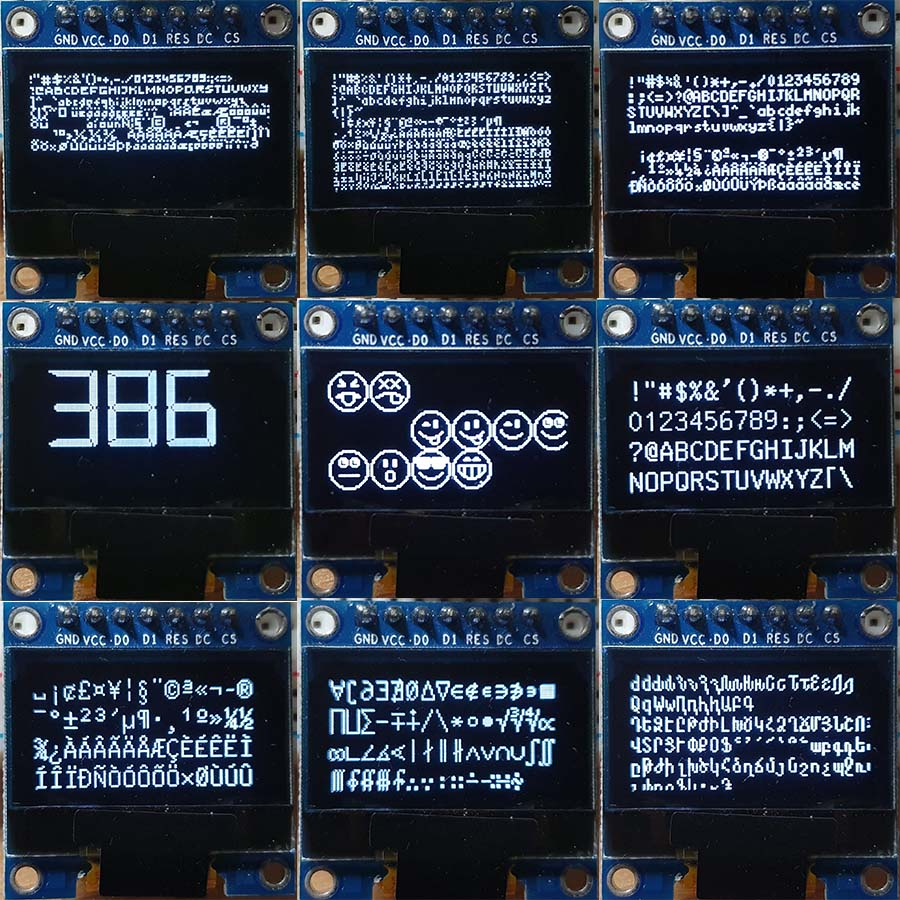

# Chisel
[](https://circleci.com/gh/luisgabrielroldan/chisel)
[](https://hex.pm/packages/chisel)
[](https://hexdocs.pm/chisel)

Chisel is a library that uses bitmap fonts to sculpt text on any device that can handle pixels.

## Setup

Add Chisel to your mix.exs deps:

```elixir
{:chisel, "~> 0.2.0"},
```

Run `mix deps.get` to download the new dependency.

## Usage

1. Take a function to draw pixels...

```elixir
  put_pixel = fn x, y ->
    thing.draw_pixel(x, y, ...)
  end
```

2. Pick a BDF font (Look for one on the Internet or take one from the fixtures folder on this project)

```elixir
  {:ok, font} = Chisel.Font.load("foo/bar/font.bdf")
```

3. Use Chisel to sculpt the text using the provided function and font

```elixir
  Chisel.Renderer.draw_text("Hello World!", x, y, font, put_pixel)
```

4. Enjoy!



(Thanks to [lawik](https://github.com/lawik) for the picture)

## General purpose

Chisel is a general purpose library that can be used to render text on any target based on pixels (LCD, Led matrixs, image files, ...).

### Render on an image with `:egd`

```elixir
  img = :egd.create(200, 50)
  color = :egd.color({0, 0, 0})

  put_pixel = fn x, y ->
    :egd.line(img, {x, y}, {x, y}, color)
  end

  {:ok, font} = Chisel.Font.load("font.bdf")

  Chisel.Renderer.draw_text("Hello World!", 0, 0, font, put_pixel)

  :egd.save(:egd.render(img, :png), "test.png")
```

### Render ASCII art

```elixir
  put_pixel = fn x, y ->
    [{x, y} | pixels]
  end

  {:ok, font} = Chisel.Font.load("c64.bdf")

  {pixels, _, _} = Chisel.Renderer.reduce_draw_text("Hello World!", 0, 0, font, [], put_pixel)

  for y <- 0..10 do
    for x <- 0..100 do
      if Enum.member?(pixels, {x, y}) do
        "%"
      else
        " "
      end
    end
    |> IO.puts()
  end
```

Result:
```
                                                                                                     
                                                                                                     
 %%  %%                                          %%   %%                                   %%        
 %%  %%           %%%     %%%                    %%   %%                  %%%        %%    %%        
 %%  %%   %%%%     %%      %%     %%%%           %%   %%  %%%%   %%%%%     %%        %%    %%        
 %%%%%%  %%  %%    %%      %%    %%  %%          %% % %% %%  %%  %%  %%    %%     %%%%%    %%        
 %%  %%  %%%%%%    %%      %%    %%  %%          %%%%%%% %%  %%  %%        %%    %%  %%              
 %%  %%  %%        %%      %%    %%  %%          %%% %%% %%  %%  %%        %%    %%  %%              
 %%  %%   %%%%    %%%%    %%%%    %%%%           %%   %%  %%%%   %%       %%%%    %%%%%    %%        
                                                                                                     
                                                                                                     
```

### Samples using [OLED](https://github.com/pappersverk/oled)



Using the right font it is even possible to render unicode strings.

Many good BDF fonts are available [here](https://github.com/olikraus/u8g2/tree/master/tools/font/bdf) on the [U8g2](https://github.com/olikraus/u8g2) library repo.

Check fonts licenses [here](https://github.com/olikraus/u8g2/wiki/fntgrp).
